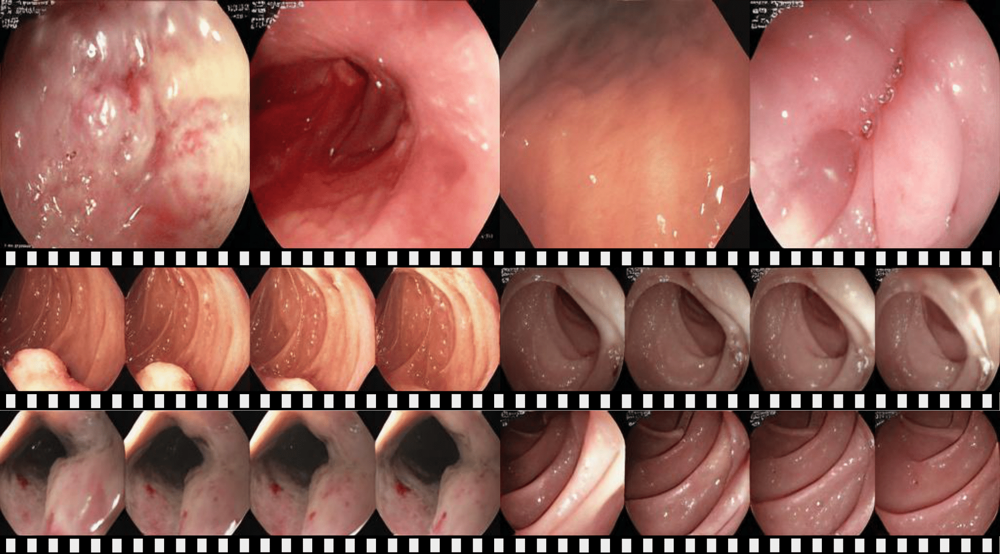
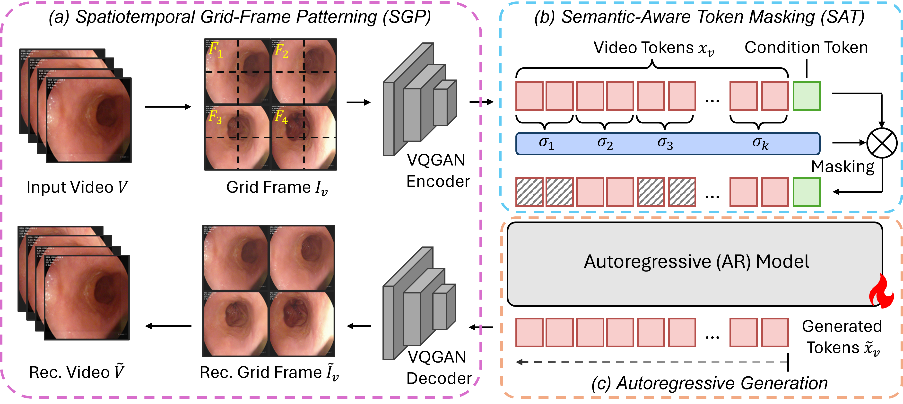

# [MICCAI 2025] EndoGen: Conditional Autoregressive Endoscopic Video Generation


> [**EndoGen: Conditional Autoregressive Endoscopic Video Generation**]()<br>
> Xinyu Liu, Hengyu Liu, Cheng Wang, Tianming Liu, Yixuan Yuan*
> <br>The Chinese University of Hong Kong, University of Georgia<br>
<!-- 
You can find more visualizations on [](https://peizesun.github.io/llamagen/) -->


## 🔥 Update
- [2025.07] Code and models of EndoGen are released.

## 🌿 Introduction

Endoscopic video generation is crucial for advancing medical imaging and enhancing diagnostic capabilities. However, prior efforts in this field have either focused on static images, lacking the dynamic context required for practical applications, or have relied on unconditional generation that fails to provide meaningful references for clinicians. Therefore, in this paper, we propose the first conditional endoscopic video generation framework, namely EndoGen. Specifically, we build an autoregressive model with a tailored Spatiotemporal Grid-Frame Patterning (SGP) strategy. It reformulates the learning of generating multiple frames as a grid-based image generation pattern, which effectively capitalizes the inherent global dependency modeling capabilities of autoregressive architectures. Furthermore, we propose a Semantic-Aware Token Masking (SAT) mechanism, which enhances the model's ability to produce rich and diverse content by selectively focusing on semantically meaningful regions during the generation process. Through extensive experiments, we demonstrate the effectiveness of our framework in generating high-quality, conditionally guided endoscopic content, and improves the performance of downstream task of polyp segmentation.




## 💡 Simple Generation with Pretrained EndoGen 

Download pretrained [VQGAN](https://huggingface.co/FoundationVision/LlamaGen/resolve/main/vq_ds16_c2i.pt), our [trained model on hyperkvasir](https://github.com/CUHK-AIM-Group/EndoGen/releases/download/models/hyperkvasir_model_0054236.pt), put them into ./pretraiend_models. Then run:
```
bash sample_c2i_512_demo.sh
```
The sampled results of 8 classes in HyperKvasir dataset will be saved in ./demo_endogen. Modify "--seed" in the script to produce different generated results.

For surgvidom, download [trained model on surgvisdom](https://github.com/CUHK-AIM-Group/EndoGen/releases/download/models/surgvisdom_model_0065324.pt), put it into ./pretraiend_models. Then modify "--gpt-ckpt" to "./pretrained_models/surgvisdom_model_0065324.pt", "--num-classes" to 3. Then also run the above script.

## 🛠 Training
See [Training](TRAINING.md) for installation, training and evaluation.


## License
The majority of this project is licensed under MIT License. Portions of the project are available under separate license of referred projects, detailed in corresponding files.

## Acknowledgement
We sincerely appreciate [LlamaGen](https://github.com/FoundationVision/LlamaGen) and [common_metrics_on_video_quality](https://github.com/JunyaoHu/common_metrics_on_video_quality) for their awesome codebases. Please contact [xinyuliu@link.cuhk.edu.hk](xinyuliu@link.cuhk.edu.hk) if you have any questions.


## BibTeX
```bibtex
@inproceedings{liu2025endogen,
  title={EndoGen: Conditional Autoregressive Endoscopic Video Generation},
  author={Liu, Xinyu and Liu, Hengyu and Wang, Cheng and Liu, Tianming and Yuan, Yixuan},
  booktitle={International Conference on Medical Image Computing and Computer-Assisted Intervention},
  year={2025}
}
```
